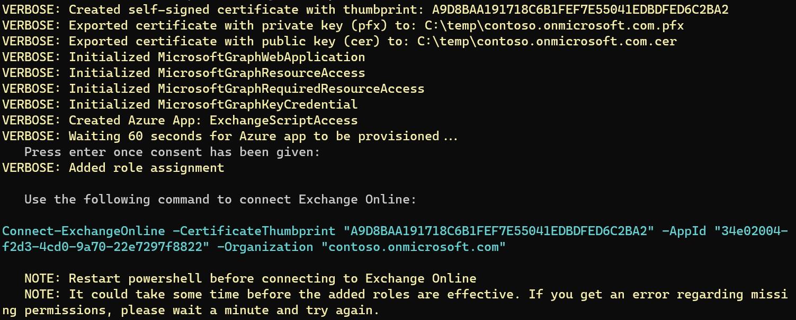

<div class="fb-share-button"
data-href="https://getps.dev/blog/setup-azure-app-for-exchange-online"
data-layout="button"
data-size="small">
</div>

:::info

This script has been integrated in the module [PSDev](https://getps.dev/modules/psdev) and is no longer provided as a stand-alone script.

:::

Microsoft has recently released (GA) version 3.0.0 of the ExchangeOnlineManagement powershell module. One of the new features is certificate based authentication which will allow unattended scripts to authenticate with Exchange Online without an interactive login prompt. Up until now you had to use basic authentication to connect to Exchange Online unattended.

Microsoft has also published documentation with all steps required to set this up. To simplify this process I wrote the script CreateEXOUnattendedAzureApp.ps1 which walks you through the process.



## Connect to Exchange Online using a certificate

You can connect to Exchange Online with a certificate in three ways.
- Passing a certificate object to Connect-ExchangeOnline
- Providing the thumbprint of the certificate. In this case the certificate must be stored in Windows Certificate Store under CurrentUser\My
- And last by providing the path to the pfx-file and the password

### By Certificate object

```powershell
$Cert = Get-Item cert:\CurrentUser\My\'<thumbprint>'
Connect-ExchangeOnline -Certificate $Cert -AppId '<appid>'
```

### By Certificate thumbprint
```powershell
Connect-ExchangeOnline -CertificateThumbprint '<thumbprint>' -AppId '<appid>'
```

### By Certificate file
```powershell
Connect-ExchangeOnline -CertificateFilePath '<path to file.pfx' -CertificatePassword (ConvertTo-SecureString -String '<password>' -AsPlainText -Force) -AppId '<appid>'
```

### Considerations for unattended scripts
In the case where you run a script as a service account with Task Scheduler for instance I would recommend to use the thumbprint method and make sure the certificate is stored in the Windows Certificate Store (This script imports the certificate to the store automatically). In this case you would not need to care about handling passwords for the certificate pfx file. Access to the certificate is based on the fact that the process running the script is authenicated as the service account which is the only account that can access the certificates in the users CurrentUser\My store. Make sure that you import the certificate to the Certificate Store of the service account. This can be acheived by running mmc.exe "as a different user" and adding the certificate snapin.

In case the script runs on linux the thumbprint method is not an option, instead use the certificate by object or file methods.

## Script

:::important

The script is available on github where you are welcome to contribute or report issues.

:::


```powershell
<#PSLicenseInfo
Copyright © 2022 Hannes Palmquist

Permission is hereby granted, free of charge, to any person obtaining a copy of this
software and associated documentation files (the "Software"), to deal in the Software
without restriction, including without limitation the rights to use, copy, modify,
merge, publish, distribute, sublicense, and/or sell copies of the Software, and to
permit persons to whom the Software is furnished to do so, subject to the following
conditions:

The above copyright notice and this permission notice shall be included in all copies
or substantial portions of the Software.

THE SOFTWARE IS PROVIDED "AS IS", WITHOUT WARRANTY OF ANY KIND, EXPRESS OR IMPLIED,
INCLUDING BUT NOT LIMITED TO THE WARRANTIES OF MERCHANTABILITY, FITNESS FOR A PARTICULAR
PURPOSE AND NONINFRINGEMENT. IN NO EVENT SHALL THE AUTHORS OR COPYRIGHT HOLDERS BE
LIABLE FOR ANY CLAIM, DAMAGES OR OTHER LIABILITY, WHETHER IN AN ACTION OF CONTRACT,
TORT OR OTHERWISE, ARISING FROM, OUT OF OR IN CONNECTION WITH THE SOFTWARE OR THE
USE OR OTHER DEALINGS IN THE SOFTWARE.

PSLicenseInfo#>
<#PSScriptInfo
{
    "VERSION": "1.0.0.0",
    "GUID": "7fef8b41-e91d-4cb0-b656-1201c3820eb8",
    "FILENAME": "CreateEXOUnattendedAzureApp.ps1",
    "AUTHOR": "Hannes Palmquist",
    "AUTHOREMAIL": "hannes.palmquist@outlook.com",
    "CREATEDDATE": "2022-10-04",
    "COMPANYNAME": "N/A",
    "COPYRIGHT": "© 2022, Hannes Palmquist, All Rights Reserved"
}
PSScriptInfo#>

[CmdletBinding()]
param (
    [Parameter(Mandatory)][string]$Organization,
    [Parameter(Mandatory)][string]$OutputDirectory,
    [Parameter()][string]$AppName = 'ExchangeScriptAccess',
    [Parameter][switch]$PassThru
)

$ErrorActionPreference = 'Stop'

$SavedVerbosePreference = $VerbosePreference
$VerbosePreference = 'SilentlyContinue'
Import-Module Microsoft.Graph.Applications, Microsoft.Graph.Authentication, Microsoft.Graph.DeviceManagement.Enrolment -Verbose:$false
$VerbosePreference = $SavedVerbosePreference

function Get-RandomPassword
{
    param (
        [int]$length = 25
    )
    $Chars = [char[]]([char]33..[char]95) + ([char[]]([char]97..[char]126)) + 0..9
    $Scramble = $Chars | Sort-Object { Get-Random }
    return ($Scramble[0..$length] -join '')
}

$ResultObjectHash = [ordered]@{
    Organization        = $Organization
    OutputDirectory     = $OutputDirectory
    AppName             = $AppName
    Certificate         = $null
    CertificatePassword = Get-RandomPassword
    CertificatePFXPath  = (Join-Path -Path $OutputDirectory -ChildPath "$Organization.pfx")
    CertificateCERPath  = (Join-Path -Path $OutputDirectory -ChildPath "$Organization.cer")
}

$null = Connect-Graph -Scopes 'Application.ReadWrite.All', 'RoleManagement.ReadWrite.Directory'

$ResultObjectHash.Certificate = New-SelfSignedCertificate -DnsName $ResultObjectHash.Organization -CertStoreLocation 'cert:\CurrentUser\My' -NotAfter (Get-Date).AddYears(1) -KeySpec KeyExchange
Write-Verbose "Created self-signed certificate with thumbprint: $($ResultObjectHash.Certificate.Thumbprint)"

$null = $ResultObjectHash.Certificate | Export-PfxCertificate -FilePath $ResultObjectHash.CertificatePFXPath -Password (ConvertTo-SecureString -String $ResultObjectHash.CertificatePassword -AsPlainText -Force)
Write-Verbose "Exported certificate with private key (pfx) to: $($ResultObjectHash.CertificatePFXPath)"

$null = $ResultObjectHash.Certificate | Export-Certificate -FilePath $ResultObjectHash.CertificateCERPath
Write-Verbose "Exported certificate with public key (cer) to: $($ResultObjectHash.CertificateCERPath)"

$Web = [Microsoft.Graph.PowerShell.Models.MicrosoftGraphWebApplication]::New()
$Web.RedirectUris = 'https://localhost'
Write-Verbose 'Initialized MicrosoftGraphWebApplication'

$ResourceAccess = [Microsoft.Graph.PowerShell.Models.MicrosoftGraphResourceAccess]::New()
$ResourceAccess.Id = 'dc50a0fb-09a3-484d-be87-e023b12c6440'
$ResourceAccess.Type = 'Role'
Write-Verbose 'Initialized MicrosoftGraphResourceAccess'

$RequiredResourceAccess = [Microsoft.Graph.PowerShell.Models.MicrosoftGraphRequiredResourceAccess]::New()
$RequiredResourceAccess.ResourceAccess = $ResourceAccess
$RequiredResourceAccess.ResourceAppId = '00000002-0000-0ff1-ce00-000000000000'
Write-Verbose 'Initialized MicrosoftGraphRequiredResourceAccess'

$KeyCred = [Microsoft.Graph.PowerShell.Models.MicrosoftGraphKeyCredential]::New()
$keycred.DisplayName = $ResultObjectHash.Organization
$KeyCred.Key = $ResultObjectHash.Certificate.RawData
$KeyCred.KeyId = $ResultObjectHash.Certificate.SerialNumber
$KeyCred.StartDateTime = $ResultObjectHash.Certificate.NotBefore
$KeyCred.EndDateTime = $ResultObjectHash.Certificate.NotAfter
$KeyCred.Usage = 'Verify'
$KeyCred.Type = 'AsymmetricX509Cert'
Write-Verbose 'Initialized MicrosoftGraphKeyCredential'

$ResultObjectHash.AzureAppRegistration = New-MgApplication  `
    -DisplayName $ResultObjectHash.AppName `
    -Description 'Used by automations that need access to exchange online' `
    -SignInAudience AzureADMyOrg `
    -Web $Web `
    -RequiredResourceAccess $RequiredResourceAccess `
    -KeyCredentials $KeyCred
Write-Verbose "Created Azure App: $($ResultObjectHash.AppName)"

$ResultObjectHash.ServicePrincipal = New-MgServicePrincipal -AppId $ResultObjectHash.AzureAppRegistration.AppId

Write-Verbose 'Waiting 60 seconds for Azure app to be provisioned...'
Start-Sleep -Seconds 60
Start-Process "https://login.microsoftonline.com/$($ResultObjectHash.Organization)/adminconsent?client_id=$($ResultObjectHash.AzureAppRegistration.Appid)"
$null = Read-Host '   Press enter once consent has been given'

$null = New-MgRoleManagementDirectoryRoleAssignment -PrincipalId $ResultObjectHash.ServicePrincipal.id -RoleDefinitionId '29232cdf-9323-42fd-ade2-1d097af3e4de' -DirectoryScopeId /
Write-Verbose 'Added role assignment'

if ($PassThru)
{
    Write-Output ([pscustomobject]$ResultObjectHash)
}
else
{
    Write-Host ''
    Write-Host '   Use the following command to connect Exchange Online:'
    Write-Host ''
    Write-Host -ForegroundColor Cyan "Connect-ExchangeOnline -CertificateThumbprint `"$($ResultObjectHash.Certificate.Thumbprint)`" -AppId `"$($ResultObjectHash.AzureAppRegistration.AppId)`" -Organization `"$($ResultObjectHash.Organization)`""
    Write-Host ''
    Write-Host '   NOTE: Restart powershell before connecting to Exchange Online' -ForegroundColor Yellow
    Write-Host '   NOTE: It could take some time before the added roles are effective. If you get an error regarding missing permissions, please wait a minute and try again.' -ForegroundColor Yellow
    Write-Host ''
}

Remove-Variable ResultObjectHash -ErrorAction SilentlyContinue

```

<Comments />
